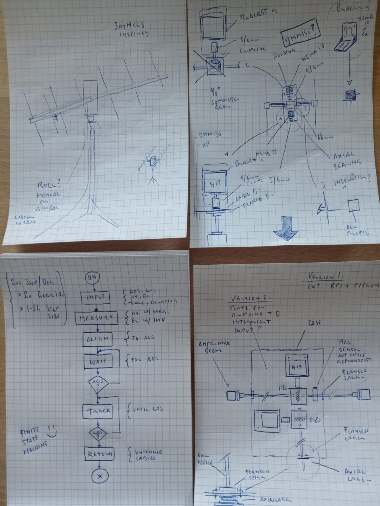
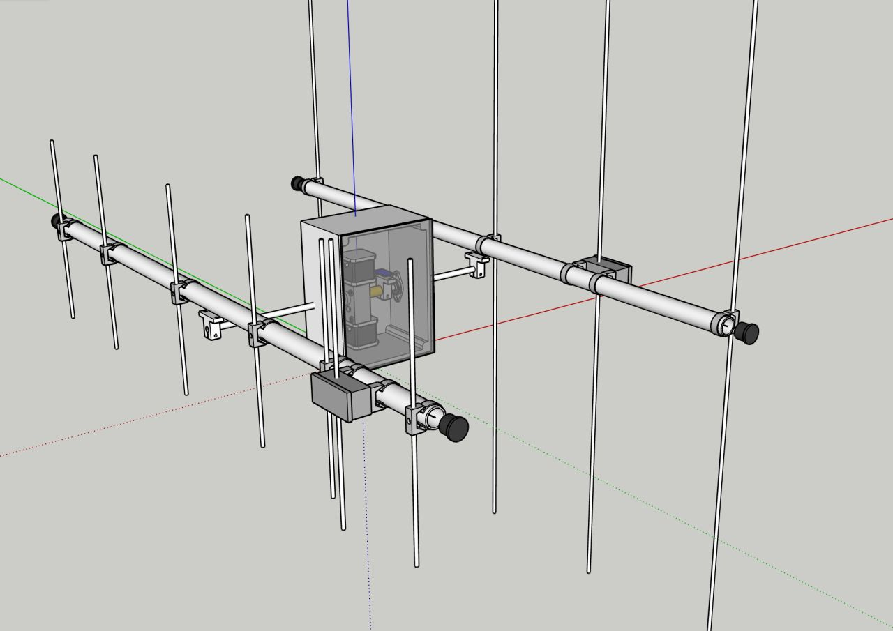
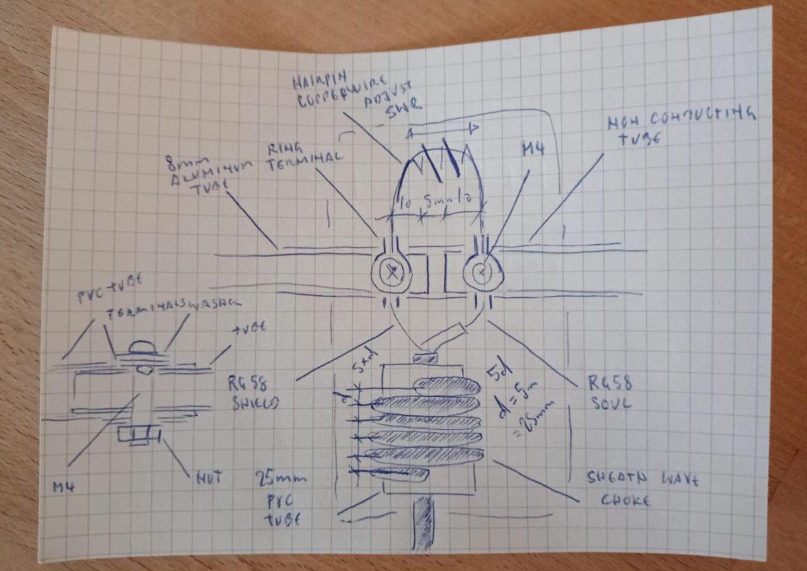

- [x] Install gpiozero on Raspberry Pi
- [x] Establish basic movement with Python through DRV8825
- [x] Write custom motor class for DRV8825 with linear and ease-in-out movement
- [ ] Parallel motor movement ?: 2x 1.7A = 3.4A + Overhead = 4A * 12 Minutes (AOS to LOS) = 0.8Ah
- [ ] Antenna for 2m Band [Yagi 4 Element 7dBd 100cm Boom](https://dk7zb.darc.de/PVC-Yagis/4-Ele-2m.htm)
- [ ] Antenna for 70cm Band [Yagi 7 Element 10dBd Gain 100cm Boom](https://dk7zb.darc.de/PVC-Yagis/7-Ele-70cm.htm)
- [ ] Optionally join antennae with a [Diplexer](https://www.wimo.com/en/22032) 100.-
- [ ] 2x Abzweigdose
- [x] 1x 25x2000mm PVC Rohr M25
- [ ] 11x 8x1000mm Rohr Aluminium
- [ ] 22x 8mm Abdeckkappe
- [ ] 8x Rohrstopfen M25 (4x Boom, 4x Radiators)
- [x] 15x Rohrbride M25
- [x] 200m Kupferdraht 1.5mm^2 isoliert (für Anpassungs-Spule)
- [ ] 4x M4 Linsenkopf
- [ ] 8x Kabelschuh 0.5mm^2 (Koax Geflecht zu Ader verzinnen, Draht direkt crimpen)
- [ ] 4x M4 Washer
- [ ] 2x PL Buchse
- [x] RG58 (von Kabelschuh auf Choke auf M25 PVC Rohr gewickelt, von da auf PL Buchse (Kabel oder Einbau))
- [x] 8x10x500mm Acryl Rohr (9x12x500mm Fallback) 
- [ ] [1x 1:30 DoubleShaft Reduction](https://de.aliexpress.com/item/1005009587865807.html)
- [ ] [1x Casing](https://www.bastelgarage.ch/mechanische-bauteile/gehause/200x150x100mm-ip67-kunststoffgehause)
- [x] [2x KFL08 Bearing](https://www.bastelgarage.ch/kfl08-8mm-kugellager-mit-halterung-horizontal?search=KFL08)
- [x] [1x Piezo Buzzer](https://www.bastelgarage.ch/piezo-buzzer-modul-mit-transistor?search=Piezo%20Buzzer%20Modul%20mit%20Transistor)
- [x] Hot glue

