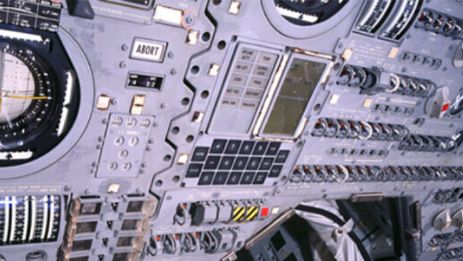
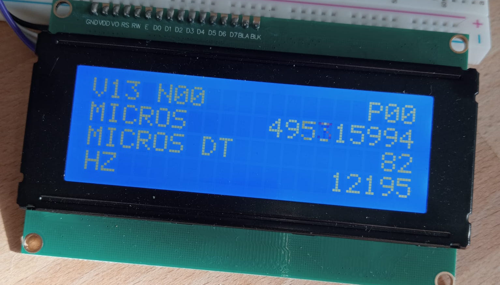
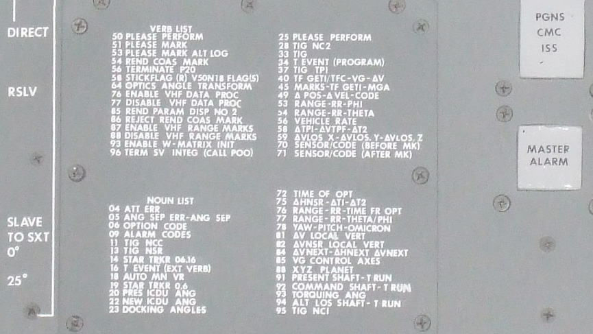

# HB9HCR Sattrack &#x1F6F0;&#xFE0F;

Manufacture an electromechanical pan/tilt device to keep Yagi antennae toward targets like ... satellites - or elephants.

## Architecture
As a hommage to the NASA Apollo program, the appliance is controlled in the manner of the Apollo Guidance Computer with servos as output and sensors as input. It also features a so called "DSKY", a user interface consisting of a display and a keyboard - in this case a 4x4 button pad. The command strucuture follows a syntax consisting of numeric sequences.



## Electronics
All the modules are wrapped into a `struct` which also contains there state and scrubbing variables. This way I prevent memory stack churn through leveraging shared scrubbing variables. The display runs at 5Hz refresh rate. All sensor data is pulled at 12.5Hz



### Actuator
- Serial Bus Servo Driver Board https://www.dfrobot.com/product-3002.html
- Servo Azimuth (tbd)
- Servo Elevation (tbd)

### Antenna
- [Yagi 7-Element 70cm Band](#antenna-70cm) (homebrew)
- [Yagi 3-Element 2m Band](#antenna-2m) (home brew)

### Sensor
- I2C BMM350 Triple-Axis Magnetometer https://www.dfrobot.com/product-2874.html
- I2C BMI160 6-Axis IMU https://www.dfrobot.com/product-1716.html
- I2C Digital Wattmeter https://www.dfrobot.com/product-1827.html

### Other
- I2C DS1307 RTC https://www.dfrobot.com/product-879.html
- I2C HUB https://www.dfrobot.com/product-2179.html
- I2C 20x4 Arduino LCD Display https://www.dfrobot.com/product-590.html
- Sealed Membrane 4*4 button pad https://www.dfrobot.com/product-450.html

## Mechanic
tbd

## Command
Interacting with the appliance happens through the DSKY by entering combinations of two integers called `verb` and `noun`. The computer (a finite state machine) will then process these combinations and execute accordingly. Apollo Command and Lunar modules had the most important `verb` and `noun` imprinted on a physical panel, so astronauts had a quick reference while operating the computer.



I took most of the verbs I use from the Apollo 15 COLOSSUS (Command Module) software. The nouns, of course, are specific to the HB9HCR Sattrack appliance. In contrast to the original DSKY, my implementation features alpha-numeric labels for the currently active registers.

#### Examples
- Display current values of a `noun` `0` and its two subsequent nouns: `verb` `0` `3` `noun` `0` `0` `entr`
- Set time value of AOS Azimuth to 10:00:00: `verb` `2` `1` `noun` `5` `0` `#` `1` `0` `0` `0` `0` `0` `#`   
- Execute program 50 (the sat tracker): `verb` `3` `7` `noun` `5` `0` `#`

### VERB
A `verb` is entered first in the sentence, followed by a `noun`. Together both form a command which can be executed by the computer. Using unassigned verbs to not have any effect. Verbs are also being used to display and manage the values stored in the computer memory. 

#### Reserved
```
00                  not in use
01                  display NOUN
02                  display NOUN, NOUN+1
03                  display NOUN, NOUN+2, NOUN+3
.
.
11                  monitor NOUN
12                  monitor NOUN, NOUN+1
13                  monitor NOUN, NOUN+1, NOUN+2
.
.
21                  load NOUN
22                  load NOUN, NOUN+1
23                  load NOUN, NOUN+1, NOUN+2
.
.
32                  recycle program
34                  terminate program
36                  restart system
37                  execute program
```

### NOUN
Together with a preceeding `verb`, the `noun` forms a command to be executed by the computer. The nouns point to a specific "address" in the computers memory. Some nouns are strictly hardware device outputs which can be used in subroutines (program). The value of these nouns will be refreshed prior to the execution of any logic code.

#### System &#x2699;
```
00 MS               Current milliseconds
01 FF               Current flip-flop based on milliseconds
02 HZ               Current processing frequency in Hertz
03 TS               Current unix timestamp
04 DATE             Current date from RTC
05 TIME             Current time from RTC
```

#### Sensor &#x1F4DF; raw
```
20 ACC X            Accelerometer X axis in g/second
21 ACC Y            Accelerometer Y axis in g/second
22 ACC Z            Accelerometer Z asis in g/second
23 GYR X            Gyrometer X axis in millidegrees?
24 GYR Y            Gyrometer Y axis in millidegrees?
25 GYR Z            Gyrometer Z asis in millidegrees?
26 MAG X            Magnetometer X axis in millidegrees
27 MAG Y            Magnetometer Y axis in millidegrees
28 MAG Z            Magnetometer Z axis in millidegrees
``` 

#### Sensor &#x1F4DF; processed
```
30 MA               Current power draw in milliamperes
31 AZ               Azimuth in millidegrees
32 EL               Elevation in millidegrees
```

#### Program 50 &#x1F6F0;&#xFE0F; (Satellite tracker )
```
50 AOS TIME         Time of acquisition of signal
51 AOS AZ           Azimuth at AOS
52 AOS EL           Elevation at AOS
53 LOS TIME         Time of loss of signal
54 LOS AZ           Azimuth at LOS
55 LOS EL           Elevation at AOS
.
.
90 STATE            Program state
91 T-               Countdown in seconds
92 AOS TS           AOS unix timestamp
93 LOS TS           LOS unit timestamp
```

## Antenna

<a name="antenna-70cm"></a>
### Yagi 7-Element 70cm Band

<a name="antenna-2m"></a>
### Yagi 3-Element 2m Band