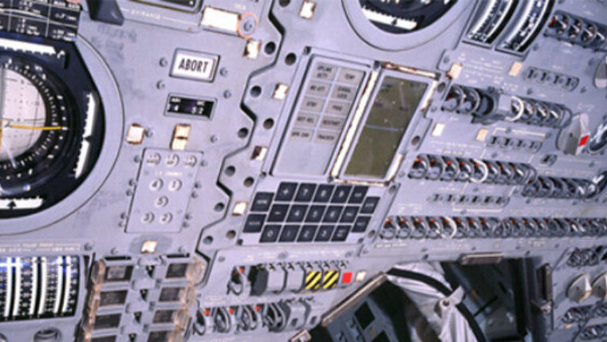
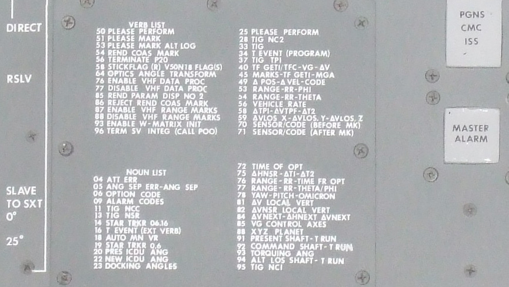
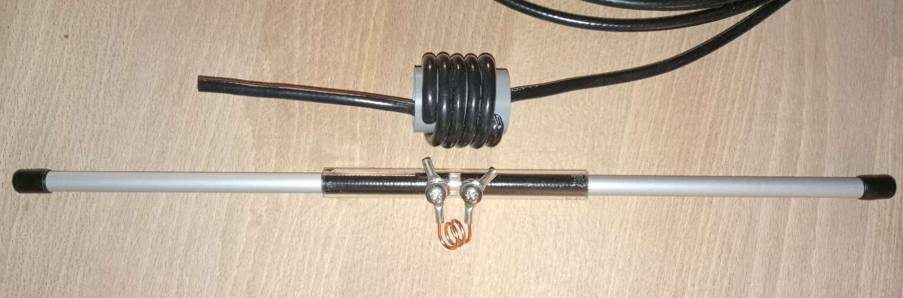

# HB9HCR Sattrack &#x1F6F0;&#xFE0F;
Challenge accepted: Manufacture an mechatronic pan/tilt appliance to keep Yagi antennas toward targets like ... well - satellites &#x1F6F0;&#xFE0F; or elephants &#x1F418; passing along, depending on your taste and actual weather situation.

## Architecture
As a hommage to the NASA Apollo program, the appliance is controlled in the manner of the Apollo Guidance Computer with servos as output and sensors as input. The command strucuture follows a syntax consisting of numeric sequences.



## Electronics

### Display
For the DSKY (display and keyboard) module of the AGC, I make use of a 20x4 I2C LCD and a 4x4 Keypad. As I really do not like the looks of the keypad, I am considering to make my own capacitive touch thingy made from copper tape and laminated or somehow ... but this is a whole different story.


### Actuator
- Serial Bus Servo Driver Board https://www.dfrobot.com/product-3002.html
- Servo Azimuth (tbd)
- Servo Elevation (tbd)

### Antenna
- [Yagi 7-Element 70cm Band](#antenna-70cm) (home brew)
- [Yagi 3-Element 2m Band](#antenna-2m) (home brew)

### Sensor
For sensing the orientation of the appliance I use Arduinos Library implementing the [Madgwick Filter](https://ahrs.readthedocs.io/en/latest/filters/madgwick.html) and wrap sensor class to combine the following sensors:

- I2C BMM350 Triple-Axis Magnetometer https://www.dfrobot.com/product-2874.html
- I2C BMI160 6-Axis IMU https://www.dfrobot.com/product-1716.html
- I2C Digital Wattmeter https://www.dfrobot.com/product-1827.html

### Other
- I2C DS1307 RTC https://www.dfrobot.com/product-879.html
- I2C HUB https://www.dfrobot.com/product-2179.html
- I2C 20x4 Arduino LCD Display https://www.dfrobot.com/product-590.html
- Sealed Membrane 4*4 button pad https://www.dfrobot.com/product-450.html

## Mechanic
tbd

## Command
Interacting with the appliance happens through the DSKY by entering combinations of two integers called `verb` and `noun`. The computer (a finite state machine) will then process these combinations and execute accordingly. Apollo Command and Lunar modules had the most important `verb` and `noun` imprinted on a physical panel, so astronauts had a quick reference while operating the computer.



I took most of the verbs I use from the Apollo 15 COLOSSUS (Command Module) software. The nouns, of course, are specific to the HB9HCR Sattrack appliance. In contrast to the original DSKY, my implementation features alpha-numeric labels for the currently active registers.

#### Examples
- Display current values of a `noun` `0` and its two subsequent nouns: `verb` `0` `3` `noun` `0` `0` `entr`
- Set time value of AOS Azimuth to 10:00:00: `verb` `2` `1` `noun` `5` `0` `#` `1` `0` `0` `0` `0` `0` `#`   
- Execute program 50 (the sat tracker): `verb` `3` `7` `noun` `5` `0` `#`

### VERB
A `verb` is entered first in the sentence, followed by a `noun`. Together both form a command which can be executed by the computer. Using unassigned verbs to not have any effect. Verbs are also being used to display and manage the values stored in the computer memory. 

#### Reserved
```
00                  -
01                  display N
02                  display N, N+1
03                  display N, N+2, N+3
.
.
11                  monitor N
12                  monitor N, N+1
13                  monitor N, N+1, N+2
.
.
21                  load N
22                  load N, N+1
23                  load N, N+1, N+2
.
.
32                  recycle program
34                  terminate program
36                  restart system
37                  execute program
```

### NOUN
Together with a preceeding `verb`, the `noun` forms a command to be executed by the computer. The nouns point to a specific "address" in the computers memory. Some nouns are strictly hardware device outputs which can be used in subroutines (program). The value of these nouns will be refreshed prior to the execution of any logic code.

#### System &#x2699;
```
00 MS               millisecond
01 DT               microsecond delta
02 FF               flip-flop
03 LP               loop count
04 HZ               Hertz           loop/second
05 STATE            state
06 UX               unix timestamp
07 DATE             date
08 TIME             time
.
10 BMI160           disable BMI160
11 BMM350           disable BMM350
12 INA219           disable INA219
```

#### Sensor &#x1F4DF; raw
```
20 ACC X            acc x           millig/second   BMI160
21 ACC Y            acc y           millig/second   BMI160
22 ACC Z            acc z           millig/second   BMI160
23 GYR X            gyr x           millig          BMI160
24 GYR Y            gyr y           millig          BMI160
25 GYR Z            gyr z           millig          BMI160
26 MAG X            mag x           microtesla      BMM350
27 MAG Y            mag y           microtesla      BMM350
28 MAG Z            mag z           microtesla      BMM350
``` 

#### Sensor &#x1F4DF; processed
```
30 VBUS             voltage bus     millivolt       INA219
31 VSHNT            voltage shunt   millivolt       INA219
32 CURR             current         milliampere     INA219
33 POWR             power           milliwatt       INA219
34 TEMP             temperature     centigree       BMM350
35 AZ               azimuth         degrees         BMI160
36 EL               elevation       degrees         BMM350
```

#### Program 50 &#x1F6F0;&#xFE0F; (Satellite tracker )
```
50 AOS TIME         Time of acquisition of signal
51 AOS AZ           Azimuth at AOS
52 AOS EL           Elevation at AOS
53 LOS TIME         Time of loss of signal
54 LOS AZ           Azimuth at LOS
55 LOS EL           Elevation at AOS
56 MAX EL           Maximum elevation
.
.
90 STATE            Program state
91 T-               Countdown in seconds
92 TS AOS           Unix timestamp AOS (from N50)
93 TS LOS           Unix timestamp LOS (from N53)
94 TS MAX EL        Unix timestamp MAX EL (from N57 + N58)
95 PASS DUR         Pass duration in seconds
96 PROGRESS         Progress of pass in percent
```

## Antenna
Home brew, based on AI results and online Yagi calculator, fine tuned with an [NanoVNA H4](https://nanovna.com). My requirements are: Leight-weigth, non-conductive Boom, equal Boom length, Coil Design Beta Match.

<a name="antenna-70cm"></a>
### Yagi 7-Element 70cm Band &#x1F4E1;


This is what my rapid prototyping brought out of a radiator. I duct-taped the aluminum tubes (50mm) just a bit so they fit into the acrylic tube (105mm) neatly and the result is a 5mm gap. Then I drilled 3.5mm holes 15mm apart and tapped M4 threads. For final assembly I will use conductive gel for the stainless steel screws through a lock-washer (to bite into the acryl), washer, two ring terminals and another washer on top. For the beta match I used a 100mm 1.5mm<sup>2</sup> wire and 2 windings around the aluminum tube.

#### Dimensions
The following dimensions are calculated based on the classic DL6WU design for 8mm aluminum elements mounted through or on a non-conductive PVC boom.

```
Element 	    Length      Pos on Boom     Spacing Prev
--------------------------------------------------------
Reflector (REF)	342 mm	     30 mm	        - 
Radiator  (RAD)	327 mm	    175 mm	        145 mm
Director 1 (D1)	310 mm	    230 mm	         55 mm
Director 2 (D2)	304 mm	    365 mm	        135 mm
Director 3 (D3)	299 mm	    535 mm	        170 mm
Director 4 (D4)	295 mm	    735 mm	        200 mm
Director 5 (D5)	291 mm	    960 mm	        225 mm
```

#### BOM
- [ ] 1x 1000mm M25 PVC Tube
- [ ] 2x M25 Cap
- [ ] 1x 35mm M25 PVC Tube (Choke, 5 windings, 5.5mm holes)
- [ ] 9x M25 PVC Clamp
- [ ] 4x 1000mm 8mm Aluminum Tube
- [ ] 14x 8mm Cap
- [ ] 1x 105mm 12mm Acrylic Tube (Radiator Connector, 5mm Gap)
- [ ] 50mm Duct Tape
- [ ] 2x M4x8mm (Feedpoints)
- [ ] 4x Ring Terminal 4mm (Coax + Beta Match)
- [ ] 1x 100mm 1.5mm<sup>2</sup> Copper Wire (Coil Beta Match)
- [ ] 1x Case?
- [ ] 2x Grommet (Radiator)
- [ ] 1x Aircell-5
- [ ] 1x PL Female

<a name="antenna-2m"></a>
### Yagi 3-Element 2m Band &#x1F4E1;

#### BOM
- [ ] 1x 1000mm M25 PVC Tube
- [ ] 2x M25 Cap
- [ ] 1x 35mm M25 PVC Tube (Choke, 5 windings, 5.5mm holes)
- [ ] 5x M25 PVC Clamp
- [ ] 4x 1000mm 8mm Aluminum Tube
- [ ] 1x 1000mm 10mm Aluminum Tube (Reflector Connector)
- [ ] 6x 8mm Cap
- [ ] 1x 105mm 12mm Acrylic Tube (Radiator Connector, 5mm Gap)
- [ ] 50mm Duct Tape
- [ ] 4x M4x8mm (Feedpoint + Reflector Connector)
- [ ] 4x Ring Terminal 4mm (Coax + Beta Match)
- [ ] 1x 100mm 1.5mm<sup>2</sup> Copper Wire (Coil Beta Match)
- [ ] 1x Case?
- [ ] 2x Grommet (Radiator)
- [ ] 1x Aircell-5
- [ ] 1x PL Female
