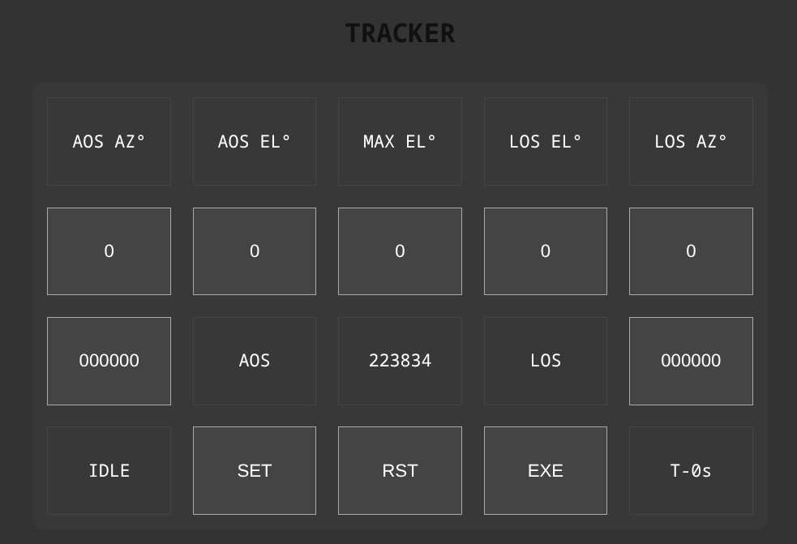
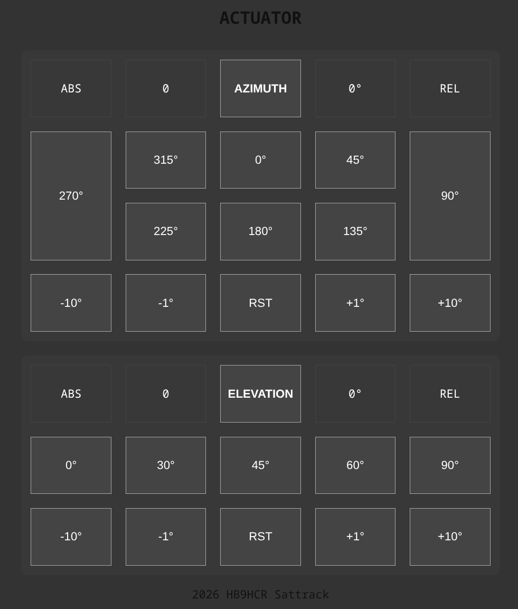
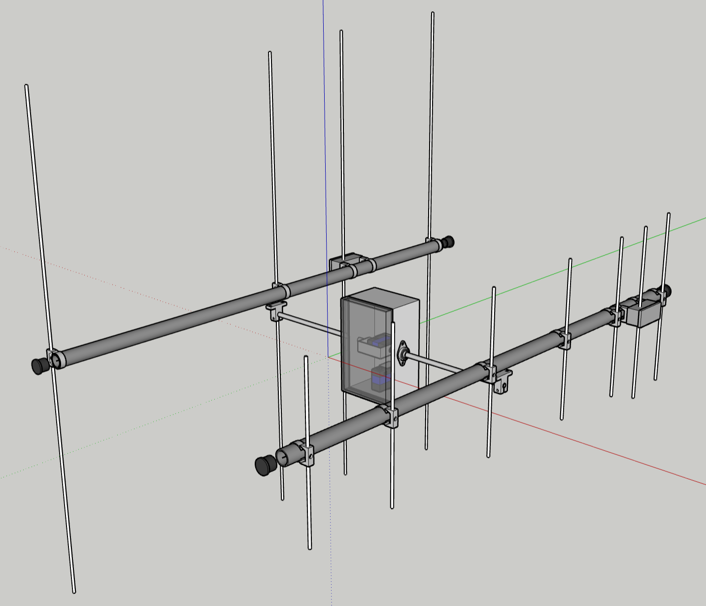

# HB9HCR Sattrack &#x1F6F0;&#xFE0F;
Prototype mk2 is capable of calibration and interpolating a satellite pass through the visible sky.


The device features a webserver which serves a command page over WiFi.


The actuator section is disabled if the user parametrizes a satellite pass in the top tracker section. From left to right the following parameters have to be keyed in, time offset is the current day plus 6-digit military time. Control input by `SET`, ` RST` and `EXE` buttons.



Clicking the buttons commands the axis servos to move to the chosen position or in increments of &plusmn;1° or &plusmn;10°. `RST` will set the respective axis offsets to 0. Tapping the axis itself, `AZIMUTH` and `ELEVATION`, triggers a calibration routing. 


Currently only `ELEVATION` will level itself to 0°.

### Actuator
- UART Servo Driver Board https://www.dfrobot.com/product-3002.html
- ST3020 Servo Azimuth https://www.waveshare.com/wiki/ST3020_Servo
- ST3020 Servo Elevation https://www.waveshare.com/wiki/ST3020_Servo

### Antenna
- [Yagi 7-Element 70cm Band](#antenna-70cm) (home brew)
- [Yagi 3-Element 2m Band](#antenna-2m) (home brew)

### Sensor
- I2C BMM350 Triple-Axis Magnetometer https://www.dfrobot.com/product-2874.html (not implemented due to magnetic interference)
- I2C BMI160 6-Axis IMU https://www.dfrobot.com/product-1716.html
- I2C Digital Wattmeter https://www.dfrobot.com/product-1827.html (not implemented yet)

### Other
- I2C HUB https://www.dfrobot.com/product-2179.html (not used at the moment)

## Mechanic
tbd

## Antenna



Home brew, based on AI results and online Yagi calculator, fine tuned with an [NanoVNA H4](https://nanovna.com), I try to build my own. My requirements are: Leight-weigth, non-conductive Boom, equal Boom length, Coil Design Beta Match.

<a name="antenna-70cm"></a>
### Yagi 7-Element 70cm Band &#x1F4E1;

This is what my rapid prototyping brought out of a radiator. I duct-taped the aluminum tubes (50mm) just a bit so they fit into the acrylic tube (105mm) neatly and the result is a 5mm gap. Then I drilled 3.5mm holes 15mm apart and tapped M4 threads. For final assembly I will use conductive gel for the stainless steel screws through a lock-washer (to bite into the acryl), washer, two ring terminals and another washer on top. For the beta match I used a 100mm 1.5mm<sup>2</sup> wire and 2 windings around the aluminum tube.

#### Dimensions
The following dimensions are calculated based on the classic DL6WU design for 8mm aluminum elements mounted through or on a non-conductive PVC boom.

```
Element 	    Length      Pos on Boom     Spacing Prev
--------------------------------------------------------
Reflector (REF)	342 mm	     30 mm	        - 
Radiator  (RAD)	327 mm	    175 mm	        145 mm
Director 1 (D1)	310 mm	    230 mm	         55 mm
Director 2 (D2)	304 mm	    365 mm	        135 mm
Director 3 (D3)	299 mm	    535 mm	        170 mm
Director 4 (D4)	295 mm	    735 mm	        200 mm
Director 5 (D5)	291 mm	    960 mm	        225 mm
```

#### BOM
- [ ] 1x 1000mm M25 PVC Tube
- [ ] 2x M25 Cap
- [ ] 1x 35mm M25 PVC Tube (Choke, 5 windings, 5.5mm holes)
- [ ] 9x M25 PVC Clamp
- [ ] 4x 1000mm 8mm Aluminum Tube
- [ ] 14x 8mm Cap
- [ ] 1x 105mm 12mm Acrylic Tube (Radiator Connector, 5mm Gap)
- [ ] 50mm Duct Tape
- [ ] 2x M4x8mm (Feedpoints)
- [ ] 4x Ring Terminal 4mm (Coax + Beta Match)
- [ ] 1x 100mm 1.5mm<sup>2</sup> Copper Wire (Coil Beta Match)
- [ ] 1x Case?
- [ ] 2x Grommet (Radiator)
- [ ] 1x Aircell-5
- [ ] 1x PL Female

<a name="antenna-2m"></a>
### Yagi 3-Element 2m Band &#x1F4E1;

#### BOM
- [ ] 1x 1000mm M25 PVC Tube
- [ ] 2x M25 Cap
- [ ] 1x 35mm M25 PVC Tube (Choke, 5 windings, 5.5mm holes)
- [ ] 5x M25 PVC Clamp
- [ ] 4x 1000mm 8mm Aluminum Tube
- [ ] 1x 1000mm 10mm Aluminum Tube (Reflector Connector)
- [ ] 6x 8mm Cap
- [ ] 1x 105mm 12mm Acrylic Tube (Radiator Connector, 5mm Gap)
- [ ] 50mm Duct Tape
- [ ] 4x M4x8mm (Feedpoint + Reflector Connector)
- [ ] 4x Ring Terminal 4mm (Coax + Beta Match)
- [ ] 1x 100mm 1.5mm<sup>2</sup> Copper Wire (Coil Beta Match)
- [ ] 1x Case?
- [ ] 2x Grommet (Radiator)
- [ ] 1x Aircell-5
- [ ] 1x PL Female


dont forget: 
```
upload_protocol = esptool
build_src_filter = +<*> -<main.cpp> +<../test/actuator.cpp>
```