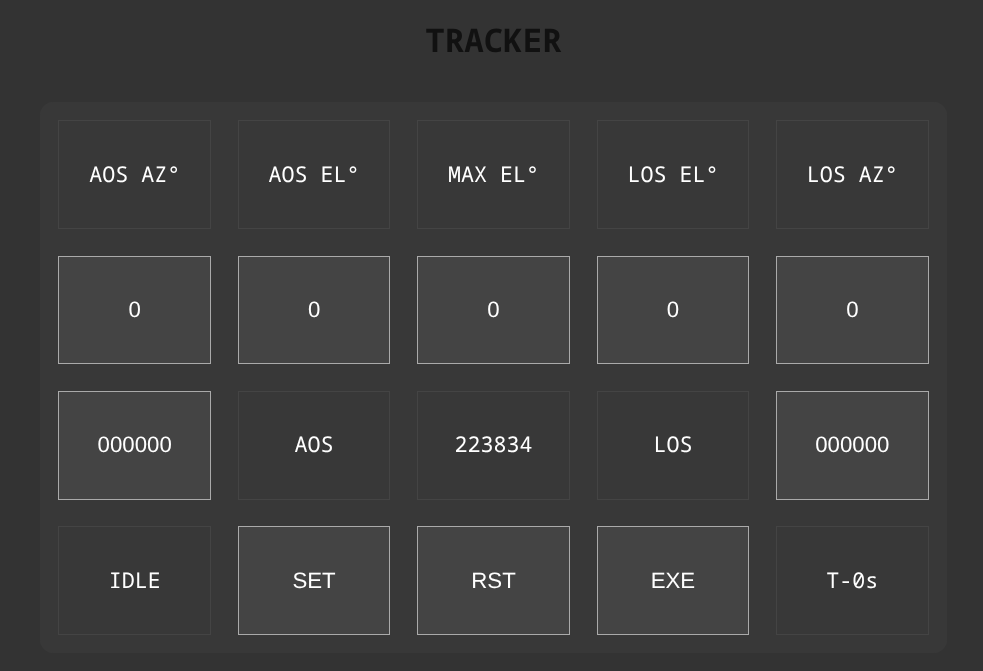
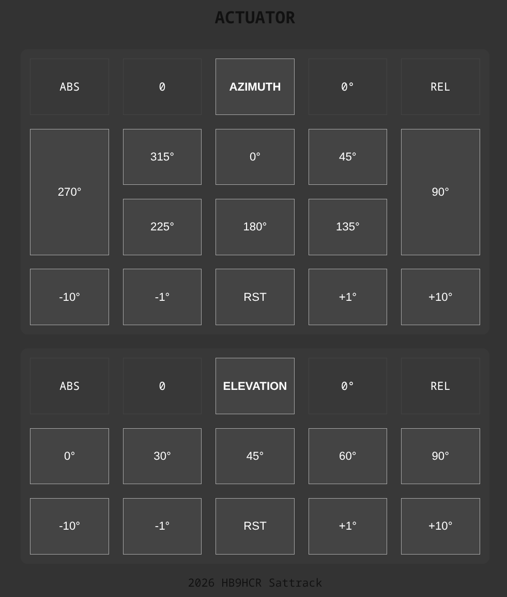
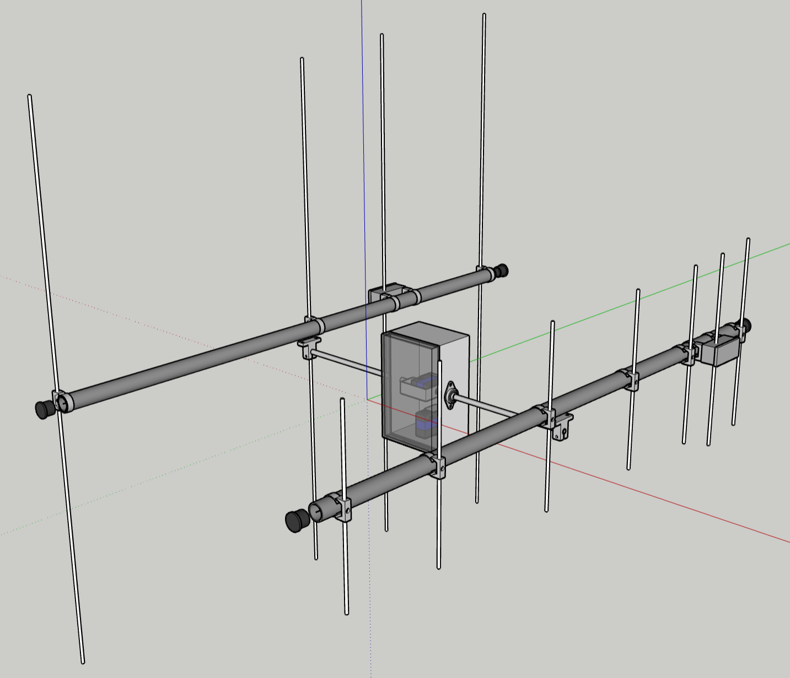

# HB9HCR Sattrack &#x1F6F0;&#xFE0F;
Prototype mk2 is capable of calibration and interpolating a satellite pass through the visible sky.


The device features a webserver which serves a command page over WiFi.


The actuator section is disabled if the user parametrizes a satellite pass in the top tracker section. From left to right the following parameters have to be keyed in, time offset is the current day plus 6-digit military time. Control input by `SET`, `RST` and `EXE` buttons.



Clicking the buttons commands the axis servos to move to the chosen position or in increments of &plusmn;1° or &plusmn;10°. `RST` will set the respective axis offsets to 0. Tapping the axis itself, `AZIMUTH` and `ELEVATION`, triggers a calibration routing. 



Currently only `ELEVATION` will level itself to 0°.

### Hardware
- 1x [Yagi 7-Element 70cm Band](#antenna-70cm) (home brew)
- 1x [Yagi 3-Element 2m Band](#antenna-2m) (home brew)
- 1x UART Servo Driver Board https://www.dfrobot.com/product-3002.html
- 2x ST3020 Servo https://www.waveshare.com/wiki/ST3020_Servo
- 1x I2C BMI160 6-Axis IMU https://www.dfrobot.com/product-1716.html

## Antenna



My requirements are: Leight-weigth, non-conductive Boom, equal Boom length, Coil Design Beta Match, simplyfied solution (`+/-5% length & 20% lambda spacing`) for element positioning.

<a name="antenna-70cm"></a>
### Yagi 7-Element 70cm Band

Center frequency **`436 MHz`**

300 / 436 = 0.688073394 = $\lambda$ 688mm

688mm * 0.5 = 344mm

344mm * 1.05 = 362mm

344mm * 0.95 = 328mm

688mm * 0.2 = 138mm

```
Element 	    Length      Position
-------------------------------------------
Reflector (REF)	362mm	    -138mm      0mm
Radiator  (RAD)	344mm	       0mm    138mm
Director 1 (D1)	328mm	    +138mm    276mm
Director 2 (D2)	328mm	    +276mm    414mm
Director 3 (D3)	328mm	    +414mm    552mm
Director 4 (D4)	328mm	    +552mm    690mm
Director 5 (D5)	328mm	    +690mm    828mm
```

<a name="antenna-2m"></a>
### Yagi 3-Element 2m Band

Center frequency **`145 MHz`**

300 / 145 = 2.068965517 = $\lambda$ 2'068mm

2'068mm * 0.5 = 1'034mm

1'034mm * 1.05 = 1'086mm

1'034mm * 0.95 = 982mm

2'068mm * 0.2 = 414mm

```
Element 	    Length      Position
-------------------------------------------
Reflector (REF)	1'086mm	    -414mm      0mm
Radiator  (RAD)	1'034mm	       0mm    414mm
Director 1 (D1)	  982mm	    +414mm    828mm
```

#### Hardware
- 8x 8x1mm Aluminum Tubes (+20x Cap)
- 2x M25x1000mm PVC Tubes (+4x Cap)
- 10x M25 PVC Clamps
- 10x MidiOTO Fuse Holder

### Platform.io notes
```
upload_protocol = esptool
build_src_filter = +<*> -<main.cpp> +<../test/actuator.cpp>
```